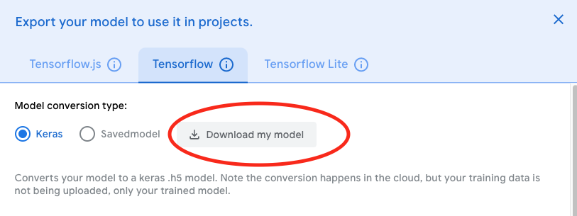

# Facial Recognition Attendance Project

## Overview

This project was created in order to use a trained and downloaded keras .h5 model to record attendance of students.

Google has made it easy for machine learning models to be created by anyone through [Teachable Machine](https://teachablemachine.withgoogle.com). Although it is nice being able to train and play around with the model on the web interface, what can be done with the model there is quite limited. This project was created specifically to leverage trained image models downloaded from Teachable Machine to take attendance. In essence, creating a script that will take attendance based on facial recognition. 

## Dependencies

The following python packages are required to run `facial_recognition.py`.

``` 
- Python packages:
  - docopt=0.6.2
  - face_recognition=1.3.0
  - numpy=1.19.5
  - opencv-python=4.5.3.56
  - pandas=1.2.2
  - Pillow=8.3.1
  - tensorflow=2.5.0
```

## Instructions

1. Clone/fork this repository.
2. Train, export and download the machine learning model from Teachable Machine 
3. Unzip the downloaded `converted_keras` folder and replace the existing `converted_keras` folder in your cloned/forked repository. 
4. Through your terminal run `python facial_recognition.py`. This will activate your webcam and the facial recognition attendance program.
5. When finished, press q in the window showing the webcam feed. This will terminate the program. 
6. The generated .csv attendance sheet will be found in the root of the folder. 

## Limitations

Attendance will be marked for a particular individual if it meets the probability threshold. However, even if a sample that is not part of any of the trained classes is shown, the sample could be marked incorrectly as being one of the known classes. This is a limitation of the trained Teachable Machine models and the probability threshold is intended to stop this from occurring. A potential avenue for further improvements is to not use Teachable Machine models and leverage some other tools and packages that would allow truly unknown samples to be identified as such.
 
